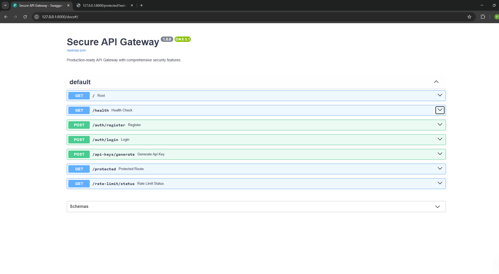
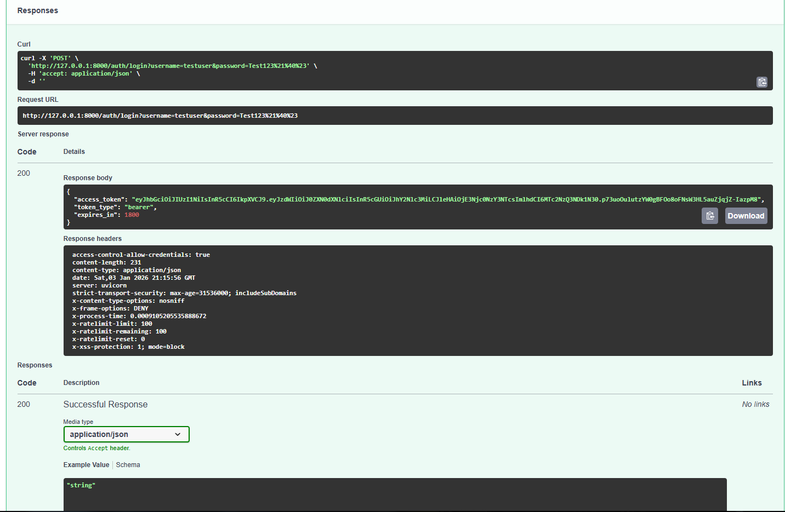
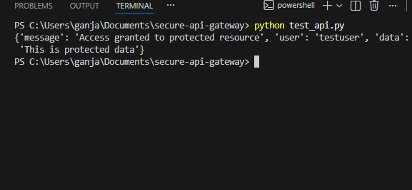
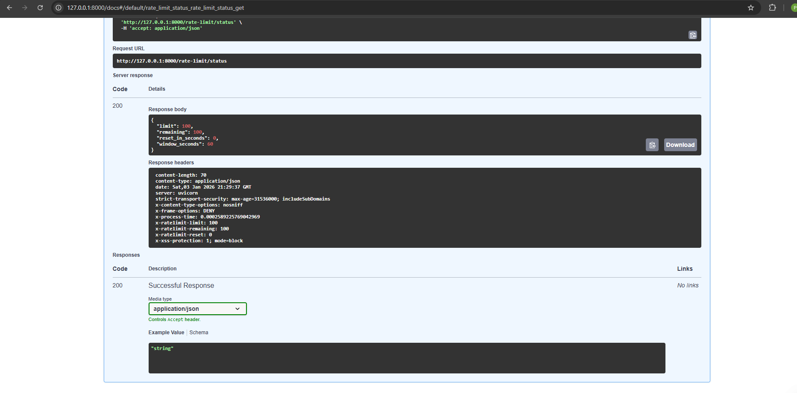
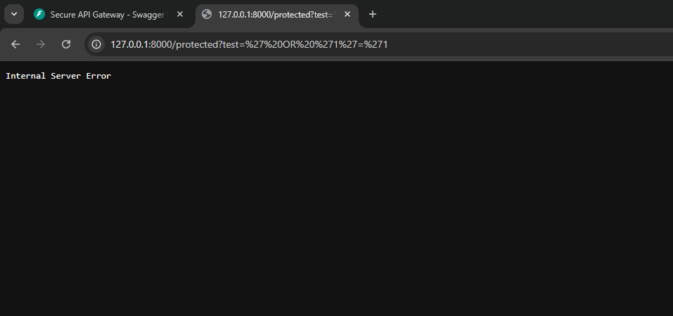

# 🔐 Secure API Gateway

<div align="center">


**Production-ready API Gateway with comprehensive security features**

[Features](#-features) • [Installation](#-installation) • [Usage](#-usage) • [API Documentation](#-api-documentation) • [Security](#-security)

</div>

---

## 🎯 Overview

A production-grade API Gateway built with FastAPI, featuring JWT authentication, rate limiting, request validation, and comprehensive security measures. Perfect for protecting backend services and managing API access.

### ✨ Key Features

- 🔐 **JWT Authentication** - Secure token-based authentication
- ⚡ **Rate Limiting** - Redis-backed rate limiting with configurable limits
- 🛡️ **Request Validation** - SQL injection and XSS prevention
- 🔑 **API Key Management** - Generate and manage API keys
- 📊 **Request Logging** - Comprehensive logging with processing times
- 🔒 **Security Headers** - HSTS, CSP, X-Frame-Options, and more
- 📝 **Auto Documentation** - Interactive Swagger UI and ReDoc
- 🚀 **High Performance** - Async/await support with FastAPI

---

## 🏗️ Architecture
```
┌─────────────┐
│   Client    │
└──────┬──────┘
       │
       ▼
┌─────────────────────────────────────┐
│     Security Middleware             │
│  ┌──────────────────────────────┐  │
│  │  Rate Limiter (Redis)        │  │
│  │  Request Validator           │  │
│  │  SQL Injection Prevention    │  │
│  │  XSS Protection              │  │
│  └──────────────────────────────┘  │
└──────────┬──────────────────────────┘
           │
           ▼
     ┌────────────┐
     │   Router   │
     └─────┬──────┘
           │
     ┌─────┴──────┐
     ▼            ▼
┌─────────┐  ┌─────────┐
│  Auth   │  │Protected│
│ Service │  │Resources│
└─────────┘  └─────────┘
```

---

## 🚀 Quick Start

### Prerequisites

- Python 3.7+
- Redis (optional - runs in fallback mode without it)

### Installation

1. **Clone the repository:**
```bash
   git clone https://github.com/Arman-1337/secure-api-gateway.git
   cd secure-api-gateway
```

2. **Install dependencies:**
```bash
   pip install -r requirements.txt
```

3. **Run the server:**
```bash
   python run.py
```

4. **Access the API:**
   - API: http://127.0.0.1:8000
   - Swagger UI: http://127.0.0.1:8000/docs
   - ReDoc: http://127.0.0.1:8000/redoc

---

## 📖 Usage

### 1. Register a User
```bash
curl -X POST "http://127.0.0.1:8000/auth/register" \
  -H "Content-Type: application/json" \
  -d '{"username": "john", "password": "SecurePass123!"}'
```

**Response:**
```json
{
  "message": "User registered successfully",
  "username": "john"
}
```

---

### 2. Login and Get Token
```bash
curl -X POST "http://127.0.0.1:8000/auth/login" \
  -H "Content-Type: application/json" \
  -d '{"username": "john", "password": "SecurePass123!"}'
```

**Response:**
```json
{
  "access_token": "eyJhbGciOiJIUzI1NiIsInR5cCI6IkpXVCJ9...",
  "token_type": "bearer",
  "expires_in": 1800
}
```

---

### 3. Access Protected Endpoint
```bash
curl -X GET "http://127.0.0.1:8000/protected" \
  -H "Authorization: Bearer YOUR_ACCESS_TOKEN"
```

**Response:**
```json
{
  "message": "Access granted to protected resource",
  "user": "john",
  "data": "This is protected data"
}
```

---

### 4. Generate API Key
```bash
curl -X POST "http://127.0.0.1:8000/api-keys/generate" \
  -H "Content-Type: application/json" \
  -d '{"name": "Production API Key"}'
```

**Response:**
```json
{
  "api_key": "xK9mP4nQ7rS2tU8vW3yZ5aB6cD1eF0gH",
  "name": "Production API Key",
  "created_at": 1704216234.567
}
```

---

### 5. Check Rate Limit Status
```bash
curl -X GET "http://127.0.0.1:8000/rate-limit/status"
```

**Response:**
```json
{
  "limit": 100,
  "remaining": 95,
  "reset_in_seconds": 45,
  "window_seconds": 60
}
```

---

## 📸 Screenshots

### Swagger UI Documentation


### Successful Authentication


### Protected Route Access


### Rate Limiting in Action


### SQL Injection Prevention


---

## 🔒 Security Features

### 1. JWT Authentication
- Secure token-based authentication
- Configurable token expiration
- HS256 algorithm
- Token verification on protected routes

### 2. Rate Limiting
- **Default:** 100 requests per 60 seconds
- Redis-backed for distributed systems
- Per-user and per-IP limiting
- Graceful fallback when Redis unavailable

### 3. Request Validation
- **SQL Injection Prevention:** Pattern matching for common SQL attacks
- **XSS Protection:** Detects and blocks XSS attempts
- **Input Sanitization:** Cleans dangerous characters

### 4. Security Headers
```http
X-Content-Type-Options: nosniff
X-Frame-Options: DENY
X-XSS-Protection: 1; mode=block
Strict-Transport-Security: max-age=31536000; includeSubDomains
```

### 5. Password Security
- Bcrypt hashing
- Configurable work factor
- Secure password verification

---

## ⚙️ Configuration

Edit `app/core/config.py` or use environment variables:
```python
# Security
SECRET_KEY = "your-secret-key"
ACCESS_TOKEN_EXPIRE_MINUTES = 30

# Rate Limiting
RATE_LIMIT_REQUESTS = 100  # requests per window
RATE_LIMIT_WINDOW = 60     # seconds

# Redis
REDIS_HOST = "localhost"
REDIS_PORT = 6379

# CORS
ALLOWED_ORIGINS = ["http://localhost:3000"]
```

---

## 📊 API Endpoints

| Method | Endpoint | Description | Auth Required |
|--------|----------|-------------|---------------|
| GET | `/` | API information | ❌ |
| GET | `/health` | Health check | ❌ |
| POST | `/auth/register` | Register new user | ❌ |
| POST | `/auth/login` | Login and get token | ❌ |
| POST | `/api-keys/generate` | Generate API key | ❌ |
| GET | `/protected` | Protected resource | ✅ |
| GET | `/rate-limit/status` | Rate limit info | ❌ |

---

## 🧪 Testing

### Manual Testing with Swagger UI

1. Navigate to http://127.0.0.1:8000/docs
2. Click "Try it out" on any endpoint
3. Fill in parameters
4. Click "Execute"

### Testing with cURL
```bash
# Test SQL injection prevention
curl "http://127.0.0.1:8000/protected?test=' OR '1'='1"

# Expected: 400 Bad Request - SQL injection detected

# Test XSS prevention
curl "http://127.0.0.1:8000/protected?search=<script>alert('XSS')</script>"

# Expected: 400 Bad Request - XSS detected

# Test rate limiting
for i in {1..105}; do curl http://127.0.0.1:8000/health; done

# Expected: 429 Too Many Requests after 100 requests
```

---

## 🛠️ Tech Stack

- **Framework:** FastAPI 0.104.1
- **Server:** Uvicorn (ASGI)
- **Authentication:** python-jose (JWT)
- **Password Hashing:** passlib + bcrypt
- **Rate Limiting:** Redis
- **Database:** SQLAlchemy (SQLite default)
- **Validation:** Pydantic

---

## 📁 Project Structure
```
secure-api-gateway/
├── app/
│   ├── api/              # API routes (future)
│   ├── core/
│   │   ├── config.py     # Configuration settings
│   │   └── security.py   # Security utilities
│   ├── middleware/
│   │   ├── rate_limiter.py    # Rate limiting
│   │   └── validator.py       # Request validation
│   ├── models/           # Database models (future)
│   ├── utils/            # Utility functions (future)
│   └── main.py           # FastAPI application
├── logs/                 # Application logs
├── docs/                 # Documentation
├── tests/                # Unit tests (future)
├── run.py                # Server runner
├── requirements.txt      # Dependencies
└── README.md            # This file
```

---

## 🚀 Deployment

### Docker (Coming Soon)
```bash
docker build -t secure-api-gateway .
docker run -p 8000:8000 secure-api-gateway
```

### Production Setup

1. **Set strong SECRET_KEY:**
```bash
   export SECRET_KEY="your-very-long-random-secret-key-here"
```

2. **Setup Redis:**
```bash
   docker run -d -p 6379:6379 redis:latest
```

3. **Use production ASGI server:**
```bash
   uvicorn app.main:app --host 0.0.0.0 --port 8000 --workers 4
```

---

## 📈 Roadmap

- [ ] User database with SQLAlchemy
- [ ] API key storage and validation
- [ ] OAuth2 integration
- [ ] WebSocket support
- [ ] Metrics and monitoring (Prometheus)
- [ ] Docker containerization
- [ ] CI/CD pipeline
- [ ] Load balancing support
- [ ] GraphQL gateway
- [ ] Microservices routing

---

## 🤝 Contributing

Contributions welcome! Please:

1. Fork the repository
2. Create a feature branch (`git checkout -b feature/amazing-feature`)
3. Commit your changes (`git commit -m 'Add amazing feature'`)
4. Push to the branch (`git push origin feature/amazing-feature`)
5. Open a Pull Request

---

## 📄 License

This project is licensed under the MIT License - see the [LICENSE](LICENSE) file for details.

---

## 👤 Author

**Arman Bin Tahir**

- 🔐 Cybersecurity Engineer
- 🐍 Backend Developer
- ☁️ Cloud Security Enthusiast
- 🎓 Computer Science @ UMT

**Connect:**
- 📧 Email: armantahir.1023@gmail.com
- 💼 LinkedIn: [linkedin.com/in/arman-tahir](https://www.linkedin.com/in/arman-tahir-1b79b52b7/)
- 🐙 GitHub: [github.com/Arman-1337](https://github.com/Arman-1337)

---

## 🙏 Acknowledgments

- FastAPI team for the amazing framework
- Redis for high-performance caching
- The open-source community

---

## ⚠️ Security Notice

This is a demonstration project. For production use:

- Change default SECRET_KEY
- Use proper database (PostgreSQL)
- Implement user persistence
- Add comprehensive logging
- Set up monitoring
- Use HTTPS in production
- Regular security audits

---

<div align="center">

**⭐ Star this repo if you find it useful! ⭐**

Made with ❤️ by [Arman Bin Tahir](https://github.com/Arman-1337)

</div>